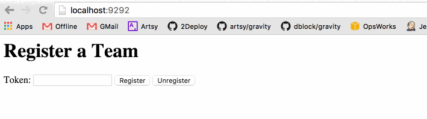

Slack Bot Server
================

### Wat?

A [Grape](http://github.com/ruby-grape/grape) API serving a [Slack Ruby Bot](https://github.com/dblock/slack-ruby-bot) to multiple teams.

### Run

Requires [MongoDB](https://www.mongodb.org/downloads) to store teams.

Run `bundle install` and `rackup`.

Create a new bot integration. This is something done in Slack, under [integrations](https://artsy.slack.com/services). Create a [new bot](https://artsy.slack.com/services/new/bot), and note its API token.

Navigate to [localhost:9292](http://localhost:9292) and register the team using a token. The bot will join your #general channel. Say "hi" to it.

### Copyright & License

Copyright [Daniel Doubrovkine](http://code.dblock.org), 2015

[MIT License](LICENSE)
