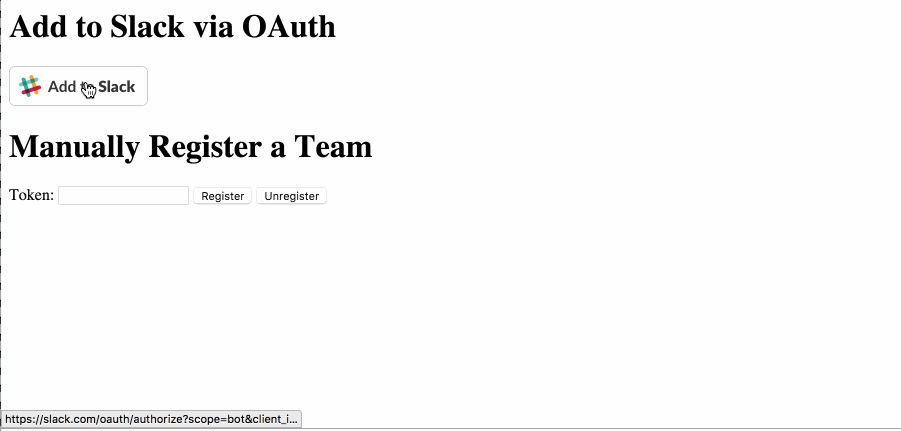
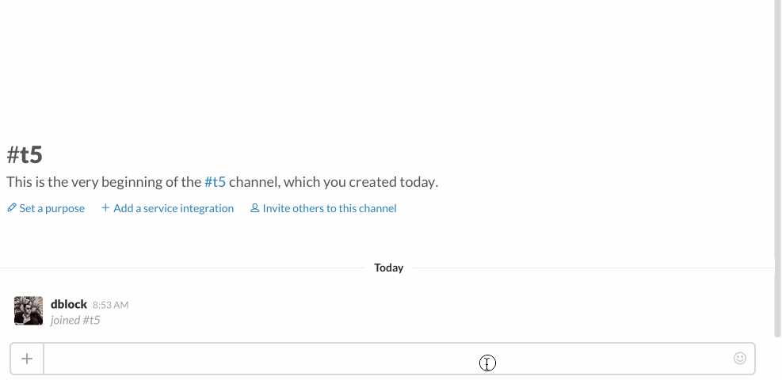
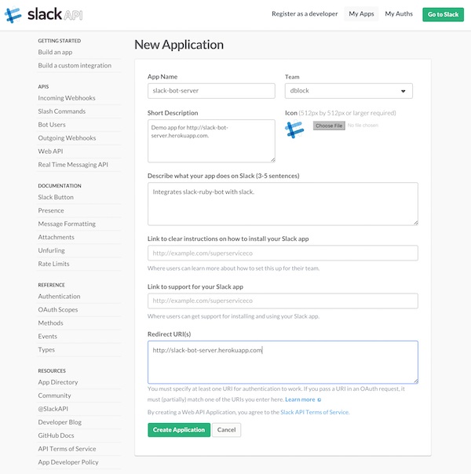

Slack Ruby Bot Server
=====================

[](https://badge.fury.io/rb/slack-ruby-bot-server)
[](https://travis-ci.org/dblock/slack-ruby-bot-server)
[](https://codeclimate.com/github/dblock/slack-ruby-bot-server)

A library that enables you to write a complete Slack bot service with Slack button integration, in Ruby. If you are not familiar with Slack bots or Slack API concepts, you might want to watch [this video](http://code.dblock.org/2016/03/11/your-first-slack-bot-service-video.html). A good demo of a service built on top of this is [missingkidsbot.org](http://missingkidsbot.org).

### What is this?

A library that contains a [Grape](http://github.com/ruby-grape/grape) API serving a [Slack Ruby Bot](https://github.com/dblock/slack-ruby-bot) to multiple teams. This gem combines a web server, a RESTful API and multiple instances of [slack-ruby-bot](https://github.com/dblock/slack-ruby-bot). It integrates with the [Slack Platform API](https://medium.com/slack-developer-blog/launch-platform-114754258b91#.od3y71dyo). Your customers can use a Slack button to install the bot.

### Stable Release

You're reading the documentation for the **stable** release of slack-ruby-bot-server 0.3.1. See [UPGRADING](UPGRADING.md) when upgrading from an older version.

### Try Me

A demo version of the [sample app](sample_app) is running on Heroku at [slack-ruby-bot-server.herokuapp.com](https://slack-ruby-bot-server.herokuapp.com). Use the _Add to Slack_ button. The bot will join your team as _@slackbotserver_.



Once a bot is registered, you can invite to a channel with `/invite @slackbotserver` interact with it. DM "hi" to it, or say "@slackbotserver hi".



### Run Your Own

You can use the [sample application](sample_app) to bootstrap your project and start adding slack command handlers on top of this code.

Install [MongoDB](https://www.mongodb.org/downloads), required to store teams. We would like your help with [supporting other databases](https://github.com/dblock/slack-ruby-bot-server/issues/12).

[Create a New Application](https://api.slack.com/applications/new) on Slack.



Follow the instructions, note the app's client ID and secret, give the bot a default name, etc. The redirect URL should be the location of your app, for testing purposes use `http://localhost:9292`. Edit your `.env` file and add `SLACK_CLIENT_ID=...` and `SLACK_CLIENT_SECRET=...` in it. Run `bundle install` and `foreman start`. Navigate to [localhost:9292](http://localhost:9292). Register using the Slack button.

If you deploy to Heroku set `SLACK_CLIENT_ID` and `SLACK_CLIENT_SECRET` via `heroku config:add SLACK_CLIENT_ID=... SLACK_CLIENT_SECRET=...`.

### API

This library implements an app, [SlackRubyBotServer::App](lib/slack-ruby-bot-server/app.rb), a service manager, [SlackRubyBotServer::Service](lib/slack-ruby-bot-server/service.rb) that creates multiple instances of a bot server class, [SlackRubyBotServer::Server](lib/slack-ruby-bot-server/server.rb), one per team.

#### App

The app instance checks for a working MongoDB connection, ensures database indexes, performs database migrations, sets up bot aliases and log levels. You can introduce custom behavior into the app lifecycle by subclassing `SlackRubyBotServer::App` and creating an instance of the child class in `config.ru`.

```ruby
class MyApp < SlackRubyBotServer::App
  def prepare!
    super
    deactivate_sleepy_teams!
  end

  private

  def deactivate_sleepy_teams!
    Team.active.each do |team|
      next unless team.sleepy?
      team.deactivate!
    end
  end
end
```

```ruby
MyApp.instance.prepare!
```

#### Service Manager

You can introduce custom behavior into the service lifecycle via callbacks. This can be useful when new team has been registered via the API or a team has been deactivated from Slack.

```ruby
instance = SlackRubyBotServer::Service.instance

instance.on :created do |team, server, error|
  # a new team has been registered
end

instance.on :deactivated do |team, server, error|
  # an existing team has been deactivated in Slack
end

instance.on :error do |team, server, error|
  # an error has occurred
end
```

The following callbacks are supported. All callbacks receive a `team`, except `error`, which receives a `StandardError` object.

| callback       |  description                                                     |
|:--------------:|:-----------------------------------------------------------------|
| error          | an error has occurred                                            |
| creating       | a new team is being registered                                   |
| created        | a new team has been registered                                   |
| booting        | the service is starting and is connecting a team to Slack        |
| booted         | the service is starting and has connected a team to Slack        |
| stopping       | the service is about to disconnect a team from Slack             |
| stopped        | the service has disconnected a team from Slack                   |
| starting       | the service is (re)connecting a team to Slack                    |
| started        | the service has (re)connected a team to Slack                    |
| deactivating   | a team is being deactivated                                      |
| deactivated    | a team has been deactivated                                      |
| resetting      | the service is resetting, all teams being stopped                |
| reset          | the service has been reset, all teams have been stopped          |

#### Server Class

You can override the server class to handle additional events, and configure the service to use it.

```ruby
class MyServer < SlackRubyBotServer::Server
  on :hello do |client, data|
    # connected to Slack
  end

  on :channel_joined do |client, data|
    # the bot joined a channel in data.channel['id']
  end
end

SlackRubyBotServer.configure do |config|
  config.server_class = MyServer
end
```

### Examples Using Slack Ruby Bot Server

* [slack-amber-alert](https://github.com/dblock/slack-amber-alert), free service at [missingkidsbot.org](https://www.missingkidsbot.org)
* [slack-gamebot](https://github.com/dblock/slack-gamebot), free service at [www.playplay.io](https://www.playplay.io)
* [slack-market](https://github.com/dblock/slack-market), free service at [market.playplay.io](https://market.playplay.io)

### Copyright & License

Copyright [Daniel Doubrovkine](http://code.dblock.org), 2015-2016

[MIT License](LICENSE)
